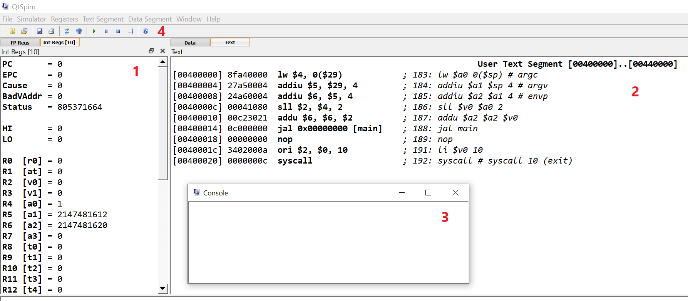
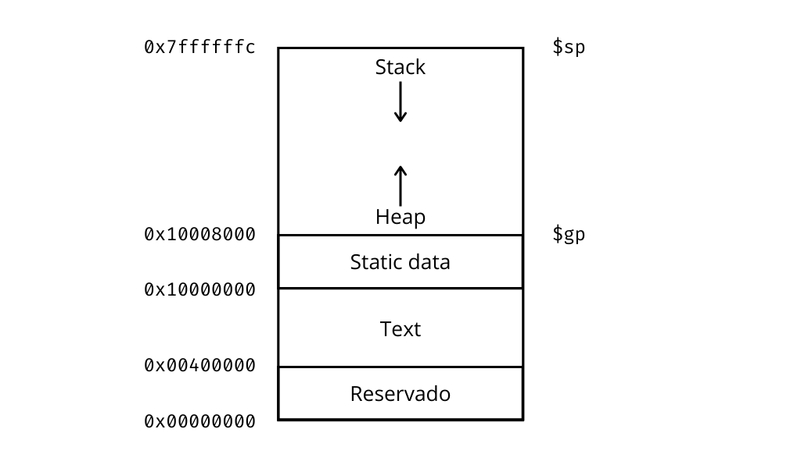

# Introducción a MIPS

Una introducción a la programación en _assembler_ de MIPS usando SPIM.

## La arquitectura MIPS

MIPS es una familia de microprocesadores que se remonta a 1985. Con arquitectura nos referimos al lenguaje máquina de un microprocesador, como puede ser x86, ARM o AVR. La arquitectura MIPS tiene versiones de 32 y 64 bits. Ambas versiones fueron evolucionando con el correr del tiempo, agregando o quitando instrucciones y características.

Nosotros vamos a usar un simulador llamado SPIM que implementa el conjunto de instrucciones de MIPS de 32 bits, específicamente las versiones R2000 (1985) y R3000 (1988). SPIM nos permite ejecutar programas escritos en ensamblador para estos procesadores y nos provee de un entorno de ejecución muy básico simulando un sistema operativo mediante la instrucción `syscall`.

## SPIM

Pueden descargar SPIM del [sitio oficial](http://spimsimulator.sourceforge.net/), busquen el instalador en formato MSI para Windows. Si están en Linux seguramente pueden encontrar un paquete con el nombre de `spim` o `qtspim` dependiendo de su distro.

Para trabajar con SPIM necesitan escribir su código en un archivo de texto y luego abrirlo en el simulador. La tradición indica que los archivos de código en _assembler_ llevan las extensiones `.s` o `.asm`.



La interfaz de SPIM está dividida en dos paneles. En el panel de la izquierda (1) tenemos los registros, los registros de números enteros en una pestaña y los de coma flotante en otra. Nosotros vamos a utilizar solo los registros enteros. En el panel de la derecha (2) tenemos los contenidos de nuestro archivo de _assembler_ tal como se cargan en la memoria principal. Este panel también se divide en dos pestañas, una para instrucciones del programa o código bajo el nombre de _text_. Y la otra para datos (la pestaña de _data_) donde vemos los contenidos de las distintas secciones de datos de nuestro programa tal como aparecen en la memoria.

En una ventana aparte tenemos una consola de texto (3) para interactuar con el programa que estamos ejecutando. Cuando nuestro programa interactúa con el sistema operativo (el del simulador, no el de nuestra computadora) puede utilizar la consola para realizar I/O, básicamente leer o imprimir caracteres en la consola.

Por último en la parte superior tenemos la barra de herramientas (4) donde podemos cargar un archivo de código en el simulador, ejecutarlo, blanquear todos los registros o ejecutar un programa paso a paso entre otras cosas.

## Hello world

Vamos a escribir un programa _hello world_ en _assembler_. Para eso creamos un archivo de texto y lo abrimos en nuestro editor preferido.

```console
$ touch hello.asm
$ atom hello.asm
```

En el archivo vamos a copiar el siguiente código

```
.data
hello: .asciiz "Hello world\n"    # el string que voy a imprimir

.text
.globl main
main:
  li        $v0, 4                # syscall print_string code
  la        $a0, hello            # pongo en $a0 la direccion de hello
  syscall                         # print_string syscall
  li        $v0, 10               # syscall exit code
  syscall                         # exit syscall
```

Vamos a ver en detalle que es lo que hace cada línea.

### Directivas y segmentación de memoria

En lenguaje ensamblador tenemos directivas, en el programa de arriba hay cuatro directivas que le indican al ensamblador (el programa que convierte código ensamblador a lenguaje máquina) alguna acción. La directiva `.data` indica que lo que sigue va en el segmento llamado _static data_, o sea a partir de la dirección de memoria 0x10000000. La directiva `.asciiz` indica que el _string_ `Hello world\n` es una cadena de caracteres ASCII terminada con el _null byte_ (código 0 en ASCII).

La directiva `.text` indica que lo que sigue va en el segmento de código de la memoria, desde la dirección 0x00400000 hasta el inicio de _static data_. Por último `.globl` indica que una etiqueta es un símbolo global y es accesible por otro archivo de código.

La memoria en MIPS está segmentada entre el nivel del usuario y el nivel del _kernel_ (del sistema operativo). El nivel del usuario está entre 0x00400000 y 0x80000000. El resto de la memoria está reservada para el sistema operativo. Dentro del nivel del usuario tenemos cuatro segmentos. Sus nombres tradicionales en inglés son _text_, _static data_, _dynamic data_ o _heap_ y _stack_.



Los segmentos de _text_ y _static data_ son los que contienen el código del programa y las variables o datos que se conocen al momento de compilar el programa.

Los otros dos segmentos contienen datos dinámicos, variables que se crean durante la ejecución del programa. La pila o _stack_ crece desde la dirección de memoria más alta hacia abajo, y el segmento llamado _heap_ desde el final de _static data_ hacia arriba. En casos extremos la pila y el _heap_ podrían colisionar produciéndose lo que se conoce como _stack overflow_. Ya veremos más adelante como los programas usan estos dos segmentos. En el dibujo de arriba aparecen dos registros especiales que son punteros (apuntan) al inicio de cada uno de estos segmentos: el _stack pointer_ y el _global pointer_. Una aclaración, en MIPS32 se considera una palabra de memoria a 4 bytes (32 bits), pero la memoria es direccionable por byte. Las instrucciones y los números enteros ocupan 4 bytes, una excepción importante a esto son los caracteres ASCII, que ocupan un byte cada uno.

### Etiquetas

Siguiendo con el código de _assembler_ vemos que hay dos palabras que terminan con dos puntos: `hello:` y `main:`. Esta es una de las grandes fortalezas de programar en _assembler_ en vez de código máquina, las etiquetas o _labels_.

Las etiquetas las escribimos siempre sin dejar margen o indentación, y lo único que hacen es marcar o etiquetar una dirección de memoria. Nos ahorran el tedio de tener que escribir 0x10010000 para indicar donde empieza el _string_ "Hello world". Cuando el programa es ensamblado (traducido a código máquina) todas las referencias a las etiquetas se reemplazan por sus valores numéricos.

Tal como hacemos en C es una convención indicar con la etiqueta `main:` la función principal donde arranca nuestro programa.

### Instrucciones

Por último las instrucciones propiamente dichas del programa. En este sencillo programa _hello world_ usamos solo tres instrucciones distintas:

- _Load Immediate_ o `li`: carga una constante en un registro.
- _Load Address_ o `la`: carga una dirección de memoria usando una etiqueta en un registro.
- _System Call_ o `syscall`: una llamada de sistema al OS. Le pide al sistema operativo que realice alguna operación, generalmente de I/O según los valores de ciertos registros.

Aclaración importante, `li` y `la` no son instrucciones reales de MIPS32. Son pseudoinstrucciones, es decir que el ensamblador nos provee de instrucciones que no existen en la CPU pero que se pueden expresar con instrucciones de la CPU. Esto es una comodidad para hacer más fácil de entender el código. Por ejemplo la primer instrucción `li $v0, 4` en realidad se ejecuta con `ori $2, $0, 4` que es un _or immediate_. Y peor aún, en lenguaje máquina se escribe 0x34020004. Vemos que un ensamblador nos hace la vida mucho más fácil.

### System calls

Lorem ipsum dolor sit amet, consectetur adipisicing elit, sed do eiusmod tempor incididunt ut labore et dolore magna aliqua. Ut enim ad minim veniam, quis nostrud exercitation ullamco laboris nisi ut aliquip ex ea commodo consequat. Duis aute irure dolor in reprehenderit in voluptate velit esse cillum dolore eu fugiat nulla pariatur. Excepteur sint occaecat cupidatat non proident, sunt in culpa qui officia deserunt mollit anim id est laborum.

## Otro ejemplo

Lorem ipsum dolor sit amet, consectetur adipisicing elit, sed do eiusmod tempor incididunt ut labore et dolore magna aliqua. Ut enim ad minim veniam, quis nostrud exercitation ullamco laboris nisi ut aliquip ex ea commodo consequat. Duis aute irure dolor in reprehenderit in voluptate velit esse cillum dolore eu fugiat nulla pariatur. Excepteur sint occaecat cupidatat non proident, sunt in culpa qui officia deserunt mollit anim id est laborum.
